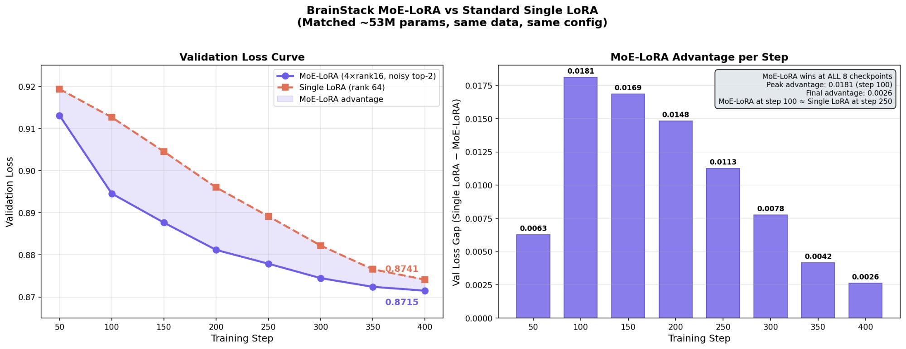

# BrainStacks

**Cross-Domain Cognitive Capabilities via Frozen MoE-LoRA Stacks for Continual LLM Learning**

Mohammad R. Abu Ayyash - [Brains Build Research](https://github.com/achelousace), Ramallah, Palestine.

[](Paper/brainstacks_paper.pdf)
[](LICENSE)


---

BrainStacks is a novel modular architecture for continual multi-domain fine-tuning of large language models. It packages domain expertise as frozen MoE-LoRA adapter stacks that compose additively on a shared frozen base model at inference. An outcome-based meta-router selectively activates relevant stacks per prompt, enabling cross-domain composition with zero forgetting.

The central finding: domain stacks learn **transferable cognitive primitives** - instruction-following clarity, numerical reasoning, procedural logic, chain-of-thought structure - rather than domain-specific knowledge. Medical prompts optimally route to chat+math stacks 97% of the time, with zero medical data in those stacks. Fine-tuning injects composable capabilities that transfer across domain boundaries, not knowledge retrieval.

## Architecture

BrainStacks is built on five interlocking components:

**1. MoE-LoRA Building Block** - Mixture-of-Experts LoRA with 4 experts (rank 16, top-2 routing) applied to all 7 transformer projections (q, k, v, o, gate, up, down) under 4-bit NF4 quantization. Uses Shazeer-style noisy routing with a dedicated `noise_linear` layer and rsLoRA rank-stabilized scaling (α/√r). Vectorized computation via einsum avoids Python loops over experts.

**2. Inner Loop (Residual Boosting)** - Within each domain, multiple MoE-LoRA stacks train sequentially. Stack 1 learns the primary correction. Stack 1 freezes, Stack 2 trains on the residual error Stack 1 left behind. Each stack deepens domain capability through iterative refinement, breaking through the single-adapter ceiling.

**3. Outer Loop (Continual Domain Training)** - Domains train sequentially in curriculum order. Each domain's stacks are frozen after training. The next domain trains on top of all previously frozen stacks, building layered capabilities without retraining.

**4. Null-Space Projection** - Before training each new domain, randomized SVD extracts the top-K principal directions from frozen stack activations. A projection matrix P = V·Vᵀ constrains the active stack's output to the orthogonal complement of all previously claimed subspaces. This is a hard geometric constraint enforced by linear algebra, not a soft regularization penalty. Zero forgetting when domains are evaluated in isolation.

**5. Outcome-Based Sigmoid Meta-Router** - A ~2M parameter neural network trained on empirically discovered domain-combination targets. For each prompt, it exhaustively tests which combination of stacks minimizes loss, then trains on those discovered targets. Sigmoid output (not softmax) enables true cross-domain composition where multiple stacks fire simultaneously.

```
┌─────────────────────────────────────────────────────────────┐
│                     Input Prompt                            │
│                         │                                   │
│                    Meta-Router                              │
│              (sigmoid per domain)                           │
│           ┌────┬────┬────┬────┬────┐                        │
│           │chat│code│math│med │rea │                        │
│           │0.85│0.02│0.91│0.03│0.04│                        │
│           └──┬─┴────┴──┬─┴────┴────┘                        │
│              │         │                                    │
│     ┌────────▼──┐  ┌───▼────────┐                           │
│     │Chat Stacks│  │Math Stacks │  (loaded from disk)       │
│     │ (frozen)  │  │ (frozen)   │                           │
│     └────────┬──┘  └───┬────────┘                           │
│              │         │                                    │
│              ▼         ▼                                    │
│     base(x) + w_chat * chat(x) + w_math * math(x)           │
│                         │                                   │
│                    Output Token                             │
└─────────────────────────────────────────────────────────────┘
```

## Key Results

**MoE-LoRA vs Single LoRA** (TinyLlama-1.1B, matched ~53M params): MoE-LoRA converges 2.5x faster per step, reaching Single LoRA's final val loss by step ~160 vs step 400.

**Residual Boosting**: Single LoRA plateaus at 0.8741 after 400 steps. BrainStacks breaks through via frozen stacked residuals, reaching 0.8531 after 3 rounds - a 2.4% relative improvement.

**Null-Space Orthogonality**: Cross-domain cosine similarity between subspace directions averages 0.034-0.047, confirming near-perfect orthogonal separation. Math-reasoning overlap (0.54) is expected due to shared training data.

**Cognitive Primitives Discovery**: The outcome-based router discovers that medical prompts route to chat+math stacks 97% of the time (1/33 route to medical). Chat stacks provide instruction-following; math stacks provide numerical reasoning. The domain label is the wrong routing signal.

**Gemma 3 12B Benchmarks** (8 zero-shot benchmarks, 200 samples each): Routed system maintains competitive performance across all benchmarks with no catastrophic degradation from stack accumulation.

| Benchmark | Base | Routed | Delta |
|---|---|---|---|
| HellaSwag | 0.670 | 0.650 | -0.020 |
| ARC-Easy | 0.510 | 0.515 | +0.005 |
| ARC-Challenge | 0.525 | 0.495 | -0.030 |
| TruthfulQA | 0.350 | 0.370 | +0.020 |
| MMLU | 0.450 | 0.435 | -0.015 |
| GSM8K | 0.665 | 0.665 | 0.000 |
| MedQA | 0.385 | 0.350 | -0.035 |
| MedMCQA | 0.330 | 0.360 | +0.030 |

## Repository Structure

```
brainstacks/
├── brainstacks_train.py      # SFT training pipeline (outer loop + inner loop)
├── brainstacks_eval.py       # 12-benchmark evaluation (base / ungated / routed)
├── brainstacks_inference.py  # Disk-offloaded interactive inference
├── meta_router.py            # Outcome-based meta-router training
├── Paper/
│   ├── brainstacks_paper.pdf # Full research paper
│   └── figures/              # All paper figures
├── LICENSE                   # MIT License
└── README.md
```

## Quick Start

### Requirements

- Python 3.10+
- CUDA GPU with 24GB+ VRAM (48GB+ recommended for Gemma 3 12B)
- PyTorch 2.0+

Dependencies install automatically on first run. Core packages: `transformers`, `trl`, `datasets`, `bitsandbytes`, `peft`.

### Step 1: Train Domain Stacks

```python
# Open brainstacks_train.py, configure:
model_name = "google/gemma-3-12b-it"   # base model
save_dir   = "./BrainStacks_gemma3"     # output directory

# Run training (5 domains: chat → code → math → medical → reasoning)
python brainstacks_train.py
```

Training produces per-domain stack files in `save_dir/`, a `manifest.json` tracking all stacks, and a `forgetting_matrix.json` recording cross-domain interference.

The domain training order matters - it follows a curriculum where each domain builds on capabilities from previous ones:

1. **Chat** - Instruction-following and output formatting (universal scaffolding)
2. **Code** - Structured/procedural thinking (benefits from chat formatting)
3. **Math** - Numerical reasoning (benefits from code's computational thinking)
4. **Medical** - Clinical knowledge (benefits from math, chat, and reasoning)
5. **Reasoning** - Chain-of-thought meta-skill (composes all prior domains)

### Step 2: Train the Meta-Router

```python
# After all domain SFT completes:
python meta_router.py
```

The router training pipeline:
1. Builds prompt-answer pairs from all domain training data
2. Runs outcome discovery - tests all domain combinations per prompt to find which minimizes loss
3. Trains a ~2M parameter router on the discovered targets
4. Saves `meta_router.pt` to the save directory

### Step 3: Evaluate

```python
# Runs 12 benchmarks in 3 modes: base / ungated / routed
python brainstacks_eval.py
```

Benchmarks: HellaSwag, ARC-Easy, ARC-Challenge, TruthfulQA, MMLU, GSM8K, HumanEval, MedQA, MedMCQA, MATH-500, AIME-2024, GPQA-Diamond.

### Step 4: Interactive Inference

```python
# Disk-offloaded inference with smart domain caching
python brainstacks_inference.py
```

Interactive commands:

| Command | Description |
|---|---|
| `/route <text>` | Show routing weights without generating |
| `/greedy` | Toggle greedy/sampling |
| `/temp 0.5` | Set temperature |
| `/tokens 512` | Set max generation tokens |
| `/stacks` | Show which stacks are loaded vs on-disk |
| `/flush` | Unload all stacks from GPU |
| `/bench` | Run benchmark prompts |
| `/compare` | Run ungated vs routed comparison |
| `/gpu` | Show GPU memory usage |
| `/quit` | Exit |

## How It Works

### Training Pipeline

Each domain goes through the following pipeline:

```
For each domain d in [chat, code, math, medical, reasoning]:
  1. Load and decontaminate domain data (Optional Decontamination)
  2. If d > 1: compute null-space projectors from all frozen stacks
  3. Inner loop (residual boosting):
     for round in 1..R:
       a. Add new trainable MoE-LoRA stack to every layer
       b. Train with BestStackCallback (snapshot best, early stop on spike)
       c. Freeze stack → offload to CPU in fp16
       d. If improvement < threshold: stop
  4. Record domain block in manifest
  5. Evaluate all prior domains (forgetting check)
```

### The Stacking Primitive

Every transformer projection (q, k, v, o, gate, up, down) is wrapped in a `StackedMoELoRALayer`:

```
output = W_frozen(x)                          # base model (4-bit, frozen)
       + frozen_stack_1(x)                     # domain 1, round 1 (frozen, fp16, CPU)
       + frozen_stack_2(x)                     # domain 1, round 2 (frozen, fp16, CPU)
       + ...
       + active_stack(x)                       # currently training (full precision, GPU)
```

Each `MoELoRADelta` stack contains 4 LoRA experts (rank 16) with noisy top-2 routing. Zero-initialized B matrices ensure new stacks start as identity (zero delta) before training.

### Null-Space Projection

```
1. Collect frozen stack output deltas on 400 validation samples
2. Stack into matrix D ∈ R^{n_samples × h_dim}
3. Compute top-64 principal directions via randomized SVD
4. Form projector P = V · V^T
5. During training: δ_projected = δ - δ · P
```

For Gemma 3 12B (h_dim=3840), each domain claiming 64 directions uses 1.7% of the space. 50+ domains can coexist before capacity concerns arise.

### Outcome-Based Router

Instead of training on domain labels ("this is medical"), the router trains on empirically discovered targets:

```
For each prompt-answer pair:
  1. Compute base-only loss
  2. Compute single-domain loss for all 5 domains
  3. Greedily search for best combination (add domains that reduce loss > 0.01)
  4. Result: multi-hot target like [chat=1.0, math=1.0, code=0.0, medical=0.0, reasoning=0.5]
```

This discovers that medical prompts need chat+math (instruction clarity + numerical reasoning), not the medical stack itself.

### Disk-Offloaded Inference (The Superposition LLM)

At inference, only the base model (~7GB in 4-bit) and router (~11MB) stay on GPU permanently. Domain stacks live on disk until needed:

```
1. Router classifies prompt → domain weights
2. Load only required stacks from disk (smart caching: skip already-loaded domains)
3. Generate with weighted stack contributions
4. Keep stacks loaded for next prompt (cache hit = zero disk I/O)
```

GPU memory is constant regardless of how many total domain stacks exist on disk. A hospital loads base + medical stacks. A law firm loads base + legal stacks. Same base model, different capabilities, no retraining.

## Configuration

Key hyperparameters in `brainstacks_train.py`:

| Parameter | Default | Description |
|---|---|---|
| `model_name` | `google/gemma-3-12b-it` | Base model |
| `lora_r` | 16 | LoRA rank per expert |
| `lora_alpha` | 16.0 | LoRA alpha (rsLoRA: α/√r) |
| `num_experts` | 4 | Experts per MoE-LoRA |
| `top_k` | 2 | Active experts per token |
| `batch_size` | 4 | Per-device batch size |
| `grad_accum` | 4 | Gradient accumulation (effective batch 16) |
| `max_steps` | 400 | Training steps per inner round |
| `max_inner_rounds` | 3 | Max residual boosting rounds |
| `ns_samples` | 400 | Samples for null-space computation |
| `ns_top_k_dirs` | 64 | Principal directions to project out |
| `max_seq_len` | 512 | Max sequence length |
| `save_dir` | `./BrainStacks_gemma3` | Output directory |

Key hyperparameters in `meta_router.py`:

| Parameter | Default | Description |
|---|---|---|
| `ROUTER_SEQ_LEN` | 256 | Prompt encoding length for router |
| `SAMPLES_PER_DOMAIN` | 2000 | Training samples per domain |
| `OUTCOME_SAMPLES_PER_DOMAIN` | 200 | Samples for oracle combo discovery |
| `CHAT_FLOOR` | 0.20 | Minimum chat activation (formatting) |
| `GATE_THRESHOLD` | 0.12 | Below this, stacks don't load |

## Datasets

### SFT Training Data (Gemma 3 12B, 5 domains)

**Chat** (~40K samples): NVIDIA Nemotron v2 chat split, UltraFeedback SFT, NVIDIA Daring-Anteater

**Code** (~48K samples): Python Code Instructions 18K, Nemotron v2 code split, OpenCodeReasoning, OpenThoughts (code-filtered)

**Math** (~53K samples): GSM8K, NVIDIA OpenMathReasoning CoT, NuminaMath-CoT, Nemotron v2 math split

**Medical** (~20K samples): MedQA-USMLE 4-options, medical-o1-reasoning-SFT, PubMedQA

**Reasoning** (~50K samples): OpenThoughts-114k, Nemotron v2 STEM split, Sky-T1, OpenMathReasoning tool-integrated

All training data is preprocessed through `strip_chat_tokens()` to remove chat template artifacts (`<start_of_turn>`, `<|im_start|>`, `[INST]`, etc.) and wrapped in a unified Alpaca prompt format.

## Design Decisions and Lessons Learned

**Dataset sensitivity is critical.** Short, repetitive datasets (medalpaca flashcards) overfit in 50 steps. ShareGPT contaminated chat with code/medical examples, causing catastrophic code domain loss explosion. This produced the decontamination subsystem (keyword-based domain detection with cross-domain reassignment).

**Domain ordering follows a curriculum.** Training medical before math caused poor medical convergence due to absent numerical reasoning capability. Each domain builds on capabilities from prior domains.

**GRPO can destroy weights catastrophically.** A training loss spike to ~28 million on one step destroyed an entire domain stack and all subsequent stacks. This produced the `BestStackCallback` with spike threshold and patience-based early stopping.

**The meta-router needs matched training data.** OpenThoughts' code-like formatting contaminated the reasoning routing signal. Replacing with LogiQA (verbal logic puzzles) and increasing `ROUTER_SEQ_LEN` from 96 to 256 resolved it. Router v1 conflated reasoning with code; v2 correctly separates them.

**Ungated stacking destroys generation quality.** After 10 stacks fire simultaneously, math's aggressive `<think>` patterns dominate all outputs. Reverse-string triggers mathematical permutation reasoning. **The meta-router is NOT optional** - it's the mechanism that makes the architecture work.

## Hardware

Validated on:
- **Google Colab G4** (NVIDIA A100, 96GB) - primary development

Minimum viable: any CUDA GPU with 24GB+ VRAM with 4-bit quantization. For Gemma 3 12B: 48GB+ recommended.

## Citation

```bibtex
@article{abuayyash2026brainstacks,
  title={Brainstacks: Cross-Domain Cognitive Capabilities via Frozen MoE-LoRA Stacks for Continual LLM Learning},
  author={Abu Ayyash, Mohammad R.},
  year={2026},
  institution={Brains Build Research}
}
```

## License

[MIT License](LICENSE) - Copyright (c) 2026 Mohammad Abu Ayyash